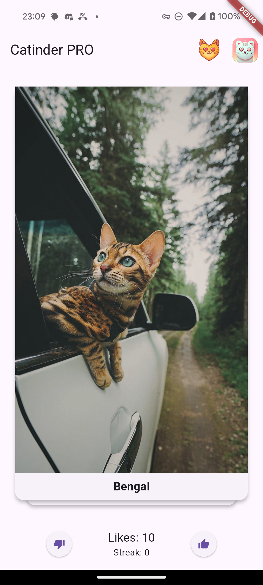

# Catinder - Cat Tinder

## Описание проекта
 Проект реализован в рамках курса "Разработка на Flutter" в ВШПИ(2 курс). В проекте необходимо реализовать подобие тиндера, но для котов

### Реализованные фичи
- На главном экране отображается случайное изображение котика и название его породы
- Изображение котика можно свайпнуть или смахнуть
- Также есть две кнопки: лайк/дизлайк
- Смахивание, свайп или нажатие на лайк/дизлайк сменяет котика на нового
- Если котика лайкнули (лайк или свайп вправо), то счетчик на экране увеличивается
- В настройках можно обнулить счетчик (настройки открываются при нажатии на иконку приложения в правом верхнем углу)
- Также в найтройках есть кнопка смены темы (светлая/темная)
- Если нажать на котика, то откроется детальное описание породы с тем же изображение котика
- Есть пасхалка: при лайке 10 котиков подряд в стопку котиков замешивается(загружается) заготовленная карточка Мейн Куна. Включается звук мяуканья при замешивании.

### Демонстрация
#### Светлая тема

#### Темная тема

### Релиз
https://github.com/Kakanom/Catinder/releases/download/First/app-release.apk
