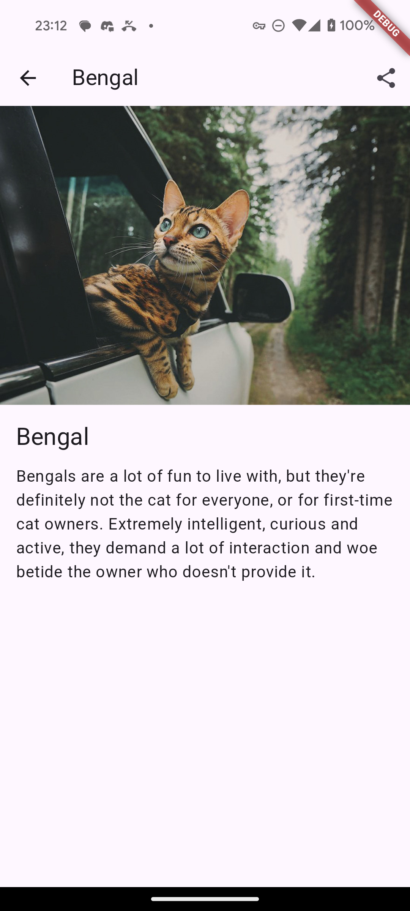
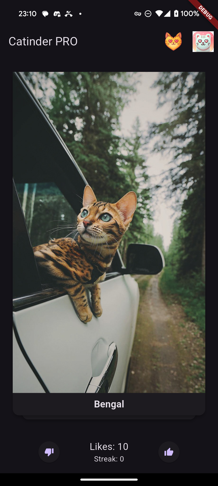
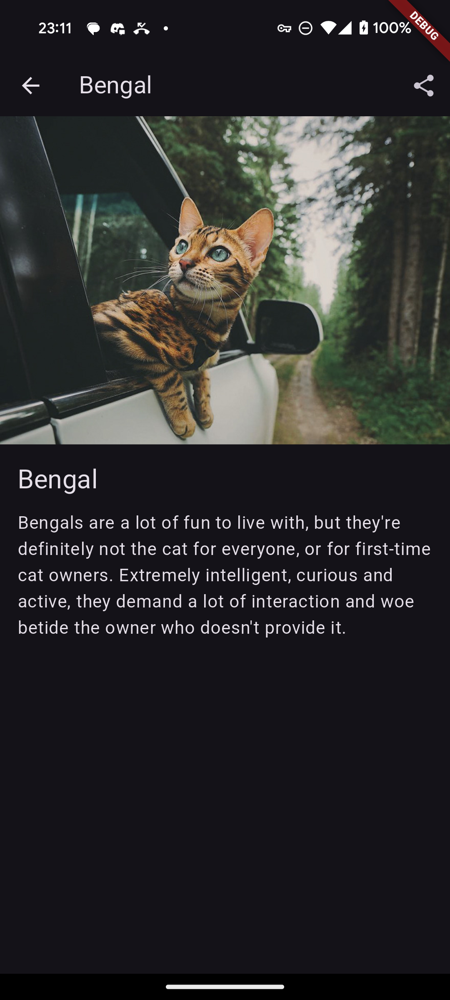
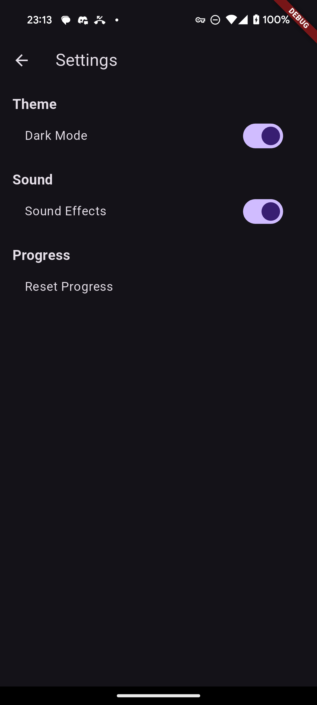
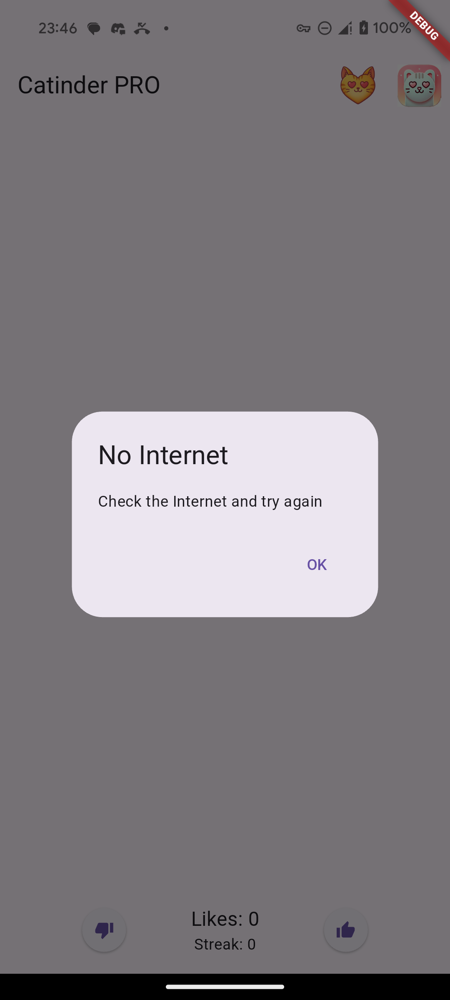
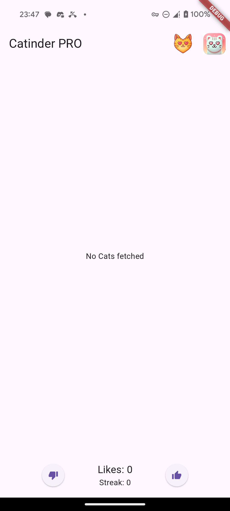

# Catinder PRO - Cat Tinder

## Описание проекта
 Проект реализован в рамках курса "Разработка на Flutter" в ВШПИ(2 курс). В проекте необходимо реализовать подобие тиндера, но для котов(PRO)

### Реализованные фичи
- На главном экране отображается случайное изображение котика и название его породы
- Изображение котика можно свайпнуть или смахнуть
- Также есть две кнопки: лайк/дизлайк
- Смахивание, свайп или нажатие на лайк/дизлайк сменяет котика на нового
- Если котика лайкнули (лайк или свайп вправо), то счетчик на экране увеличивается
- В настройках можно обнулить счетчик (настройки открываются при нажатии на иконку приложения в правом верхнем углу)
- Также в найтройках есть кнопка смены темы (светлая/темная)
- Есть кнопка, по которой можно узнать информацию о лайкнутых котах (соседняя с настройками)
- Также на этом экране можно фильтровать котов по породе и удалять, свайпая влево
- Если нажать на котика, то откроется детальное описание породы с тем же изображение котика
- На нем есть кнопка поделиться котиком
- При отсутствии сети также можно просматривать ранее лайкнутых котиков, зайти в настройки
- При отсутствии сети будет уведомление: No Internet
- Есть пасхалка: при лайке 10 котиков подряд в стопку котиков замешивается(загружается) заготовленная карточка Мейн Куна. По сравнению с прошлой версией, тут нет мяуканья при срабатывании. Мне показалось, что это может быть надоедливым. Также был удалена настройка Sound из-за ненадобности.

### Демонстрация
#### Светлая тема

#### Темная тема

#### Оффлайн

### Релиз
https://github.com/Kakanom/Catinder/releases/download/PRO/app-release.apk